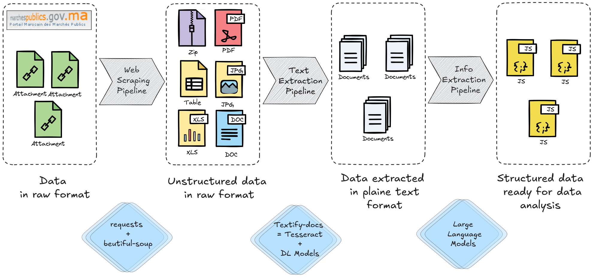

# ETL for Portail Marocain des Marchés Publics


This project focuses on transforming raw data sourced from the *Portail Marocain des Marchés Publics* (process verbals des appel d'offres) into structured data ready for analysis. The pipeline consists of several stages, utilizing various tools and libraries, including the **Textify Docs** library for text extraction and processing.

## Table of Contents
- [Overview](#overview)
- [Pipeline Stages](#pipeline-stages)
- [Requirements](#requirements)
- [Installation](#installation)
- [Usage](#usage)
- [Contributing](#contributing)
- [References](#references)

## Overview
This repository provides a comprehensive pipeline that:
1. Scrapes raw data from the *marchespublics.gov.ma* website.
2. Extracts and processes data in various unstructured formats (e.g., PDFs, images, documents).
3. Converts unstructured data into plain text using OCR and deep learning models.
4. Extracts meaningful information from plain text.
5. Transforms extracted data into structured JSON format for further analysis.

## Pipeline Stages
### 1. Web Scraping Pipeline
Web scraping tools such as `requests` and `BeautifulSoup` are employed to extract raw files (PDFs, images, tables, etc.) from the web.

### 2. Unstructured Data in Raw Format
Extracted attachments are stored in unstructured formats, such as PDFs, JPGs, XLS files, and DOC documents.

### 3. Text Extraction Pipeline
Using the **Textify Docs** library, which incorporates both Tesseract and PyTorch, images, scanned documents, and tables are converted into plain text format.

### 4. Data Extracted in Plain Text Format
The processed documents are converted into plain text, remaining unstructured.

### 5. Info Extraction Pipeline
LLMs are used to extract meaningful information from the plain text.

### 6. Structured Data Ready for Data Analysis
The final output is structured data in JSON format, ready for analysis or further data processing tasks.

## Requirements
- Python 3.x
- Required libraries (see `requirements.txt`)

## Installation
1. Clone the repository:
   ```bash
   git clone https://github.com/BlcMed/pmmp-ocr-pipeline.git
   cd yourproject
   ```
2. Install the required packages:
   ```bash
   pip install -r requirements.txt
   ```
3. Set up the environment:
   - Rename `.env.sample` to `.env`
   - Fill in the API token in the `.env` file

## Usage
The project consists of different pipelines that can be run separately:

1. OCR Pipeline:
   ```bash
   py -m src.ocr_pipeline
   ```

2. Scraping Pipeline:
   ```bash
   py -m src.scraping_pipeline
   ```

3. Info Extraction Pipeline:
   ```bash
   py -m src.info_extraction_pipeline
   ```

Ensure that the `.env` file is properly configured before running any pipeline.

## Contributing
Contributions are welcome! Please feel free to submit a pull request or open an issue.

## References
- [Textify Docs](https://github.com/BlcMed/textify_docs): Another library in this GitHub repository used for text extraction and processing.
